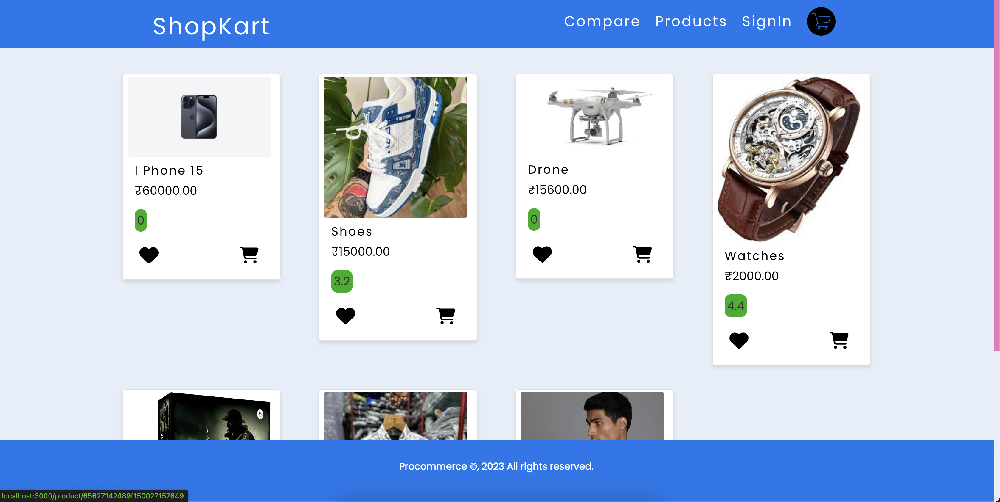
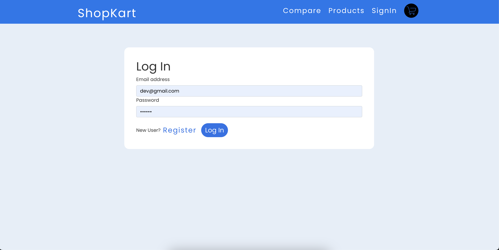
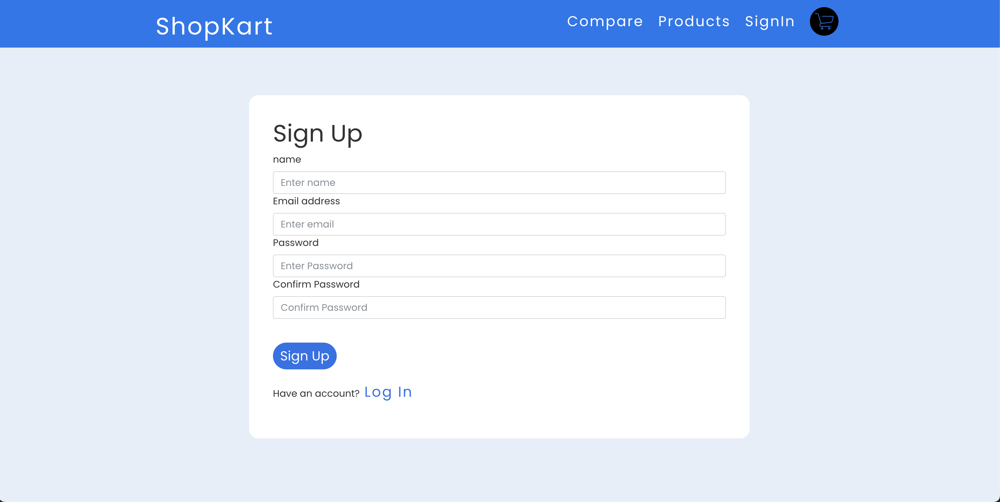
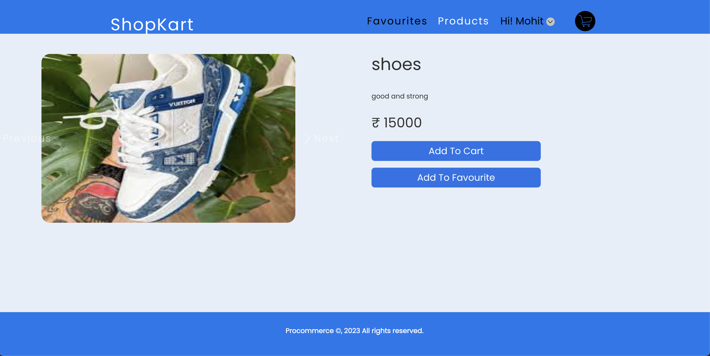
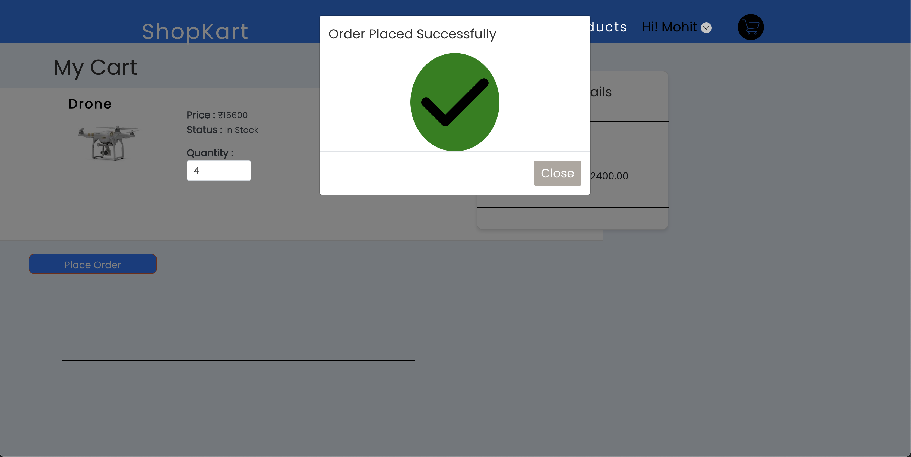
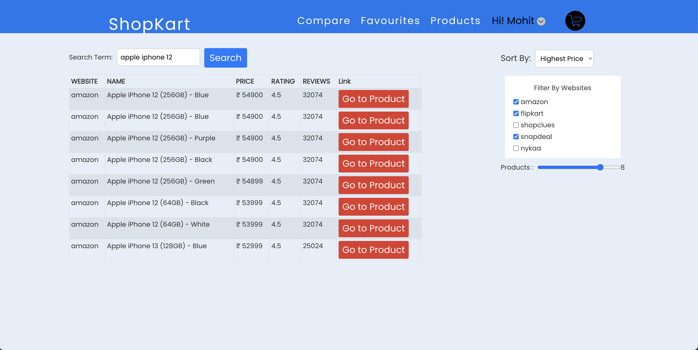

# ShopKart

Welcome to ShopKart, a dynamic Ecommerce application that allows users to add their products to cart compare products from different websites, create new products, and manage their favourite product list.


## Features

- **User Registration:** Create an account on our website using JWT user authentication for a personalized Ecommerce experience

- **Add to Cart Feature:** Users can add products to their cart for future reference or purchase.

- **Advanced Comparison Section:** Compare products from various websites like **Amazon, Flipkart, Shopclues, Snapdeal, and Nykaa**, based on parameters like price, comparision websites, and reviews.


### Live link: [ShopKart](shopkart08.netlify.app)

# Screenshots:


### Home screen


### Login Screen


### Sign Up screen


### Product detail screen


### Cart screen


### Advance product comparision scrren



## Tech Stack

- **Frontend:** Built with ReactJS, Redux and hosted on Netlify, providing a smooth and responsive user interface.

- **Authentication:** JWT (JSON Web Tokens) are used for secure user authentication, ensuring a safe and seamless login process.

- **Backend API:** I've used my own API(Hosted on Render) for authentication, getting the products list and details.
<br>
API Link: [Shopkart backend API](https://github.com/hellomohitsangwan/shopkart-backend)


## Getting Started

1. Clone the repository:

   ```bash
   git clone https://github.com/hellomohitsangwan/shopkart_ecommerce_assignment.git

2. Install dependencies:
   ```bash
    npm install

3. Start the application:
   ```bash
    # Start webapp
    npm start


4. Visit http://localhost:3000 to access the Shopkart application.


## Improvements to Submission
- **Testing: Expand test coverage by incorporating unit tests, integration tests, or end-to-end tests. This will help catch bugs early in development and ensure the reliability of the application.**


 - **Optimization: Optimize the application for performance by lazy-loading components, optimizing images, and minimizing unnecessary renders. This will result in a smoother user experience, especially for users on slower networks or less powerful devices.**

 ## If Allocated More Time

 - **Product Filtering and Sorting: Add functionality for users to filter and sort products.**

 - **User Profile: Create a user profile page for managing orders, favorites, and personal information.**

 - **Chatbot: Create a chatbot to give our users faster and easier access.**

 - **Voice assistant: Include a voice-activated assistant to help you navigate the entire app.**
 