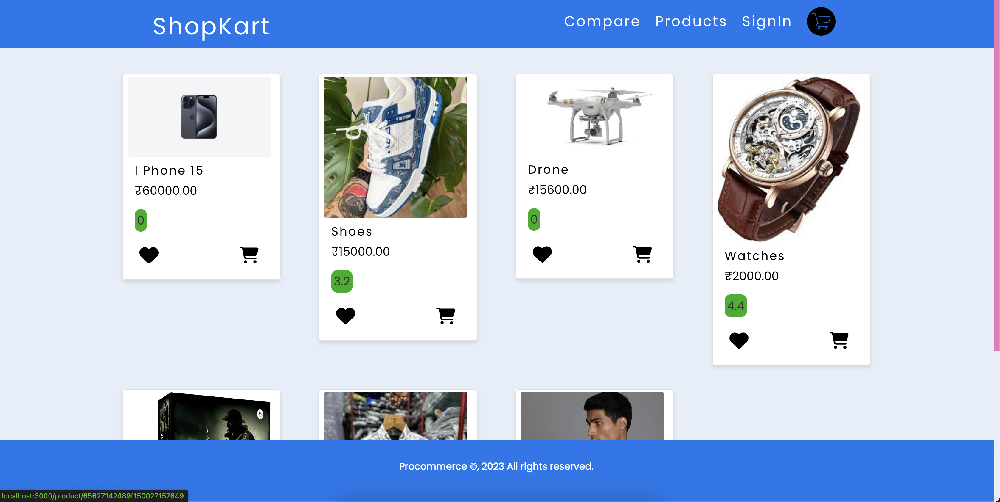
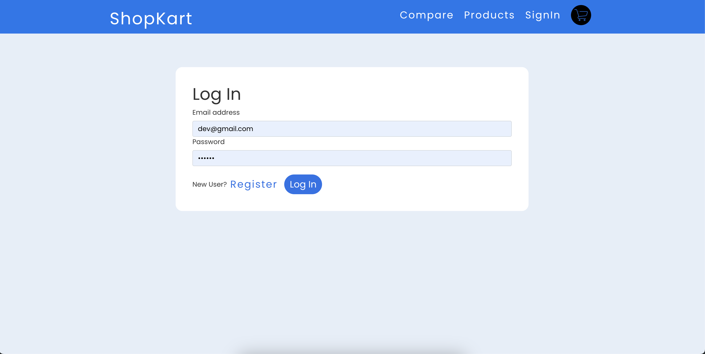
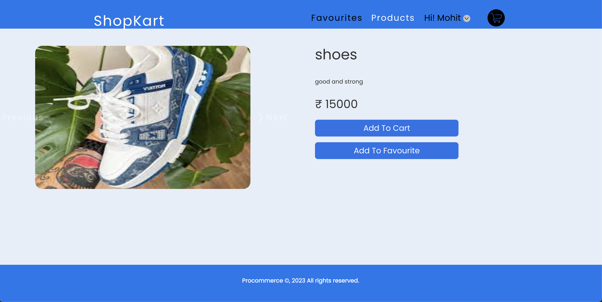
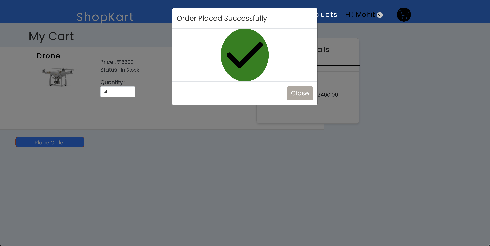
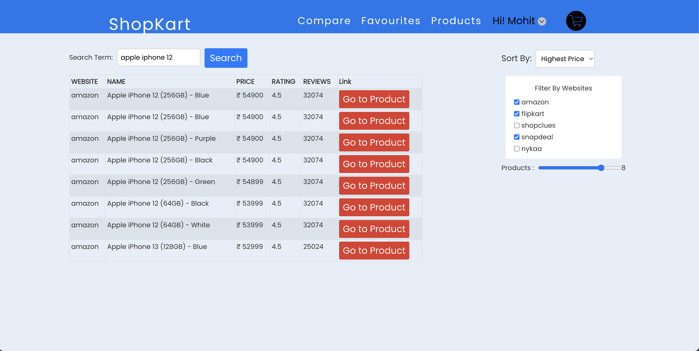

# ShopKart

Welcome to ShopKart, a dynamic Ecommerce application that allows users to add their products to cart compare products from different websites, create new products, and manage their favourite product list.


## Features

- **User Registration:** Create an account on our website using JWT user authentication for a personalized Ecommerce experience

- **Add to Cart Feature:** Users can add products to their cart for future reference or purchase.

- **Advanced Comparison Section:** Compare products from various websites like **Amazon, Flipkart, Shopclues, Snapdeal, and Nykaa**, based on parameters like price, comparision websites, and reviews.


### Live link: [ShopKart](https://shopkart.netlify.app)

# Screenshots:


### Admin's Dashboard











### Advance Comparision page


### Create Product Page(Only for admins)


### Home page


### Product Details Page


### Register Page


## Tech Stack

- **Frontend:** Built with ReactJS, Redux and hosted on Netlify, providing a smooth and responsive user interface.

- **Authentication:** JWT (JSON Web Tokens) are used for secure user authentication, ensuring a safe and seamless login process.

- **Backend API:** I've used my own API(Hosted on Render) for authentication, getting the products list and details.


## Getting Started

1. Clone the repository:

   ```bash
   git clone https://github.com/hellomohitsangwan/shopkart_ecommerce_assignment.git

2. Install dependencies:
   ```bash
    npm install

3. Start the application:
   ```bash
    # Start webapp
    npm start


4. Visit http://localhost:3000 to access the Shopkart application.